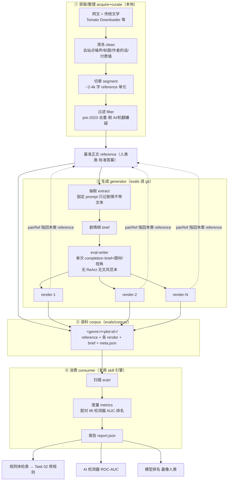

# llmlint 评测方法论（权威规范）

> **这是 `evals/` 的权威方法论与流程规范。代码按本文件实现。**
> 当代码与本文件冲突，以本文件为准——除非本文件被显式修改（改动记入对应 [walkthrough](../docs/tasks/03-llmlint-eval-harness/README.md)；涉及 prompt 的改动必须升版本，因为它改变每一个 lift 数字）。
>
> - 术语与硬不变量：[../CONTEXT.md](../CONTEXT.md)
> - 怎么跑（快速上手）：[README.md](README.md)
> - 编年实现记录：[../docs/tasks/03-llmlint-eval-harness/README.md](../docs/tasks/03-llmlint-eval-harness/README.md)

---

## 0. 为什么存在（产品论点）

用真实 DeepSeek 章节做手测：llmlint 产出 **349 条散点命中**，而人能一句话给出 **4 条诊断**（过度描写、破折号、不是而是、机器人数据化）。**散点与诊断之间的距离才是产品。** 而且没有评测，就无法判断哪条规则是真信号、哪条是噪声。

方法论要回答的唯一问题：**"规则好不好、哪条该改？"** 规则修复本身属 [Task 02](../docs/tasks/02-llmlint-rule-registry/README.md)（另一个 agent）；本方法论只管**怎么量化**。

**定位（2026-07-02）**：规则库是超集、规则无全局好坏；本方法论训出的判别器**任务敏感**——喂什么语料，就得到对什么任务纠正力强的 `task profile`（见 [CONTEXT.md §2.2](../CONTEXT.md)）。当前语料 = 网文/创意写作 → 产出的是 NeuroBook 写作 profile。verdict 是 profile 内裁决，不是全局删留令。

## 1. 顶层架构：两侧硬分离

```
生成侧 generator（本地，产数据）          消费侧 consumer（进 git，产报告）
  acquire → brief → render      ──语料──►   scan → metrics → report
  依赖模型 API、造 AI 样本                    纯函数、import skill 引擎、不 spawn CLI
```

两侧**唯一接口 = 语料/meta 契约**（§6）。消费侧对"非自产语料"也稳健（缺字段、文件不匹配、编码）。这条分离让判别仪器（纯脚本）能先建、能独立验证，不被生成器卡住。

## 2. 完整流程（authoritative pipeline）



### 2.1 生成侧（`evals/acquire/` + `evals/generator/`）

1. **acquire**：整本 epub/txt → 清洗 → 切章 → 过滤 → `reference-NNNN.md` 单元（txt 自动 GBK 解码）。人工精选"优秀且典型"的片段直接作 reference 是**不可自动化的质量闸门**。详见 [data-acquisition.md](../docs/tasks/03-llmlint-eval-harness/data-acquisition.md)。
2. **extract**：抽取器模型读一章 reference → `brief-<idx>.md`（剧情纲）。**受不变量 I1 约束：只记剧情内容，严禁文体。**
3. **render**：每个 render 模型照 brief 各写一版 `render-<idx>-<slug>.md`，`targetChars` = 本章字数，`pairRef` = 本章 reference 文件名（真 1:1 配对）。**受 I2/I3 约束：baseline 不喂文风范本、必同 brief 同题材。**

编排（`generator/generate.ts`）遍历题组每个 reference：逐章抽 brief、各模型逐章 render、merge meta。**断点续跑**：brief/render 文件已存在即跳过；单篇失败/超时/空输出只跳这一篇（`callModel` 有墙钟硬超时兜底），不拖垮整轮。

### 2.2 消费侧（`evals/` + `evals/lib/`）

| 模块 | 职责 | 关键点 |
|---|---|---|
| `lib/corpus.ts` | 读 + 校验语料 | 按 meta 契约加载；透传 `pairRef`；charCount 消费侧自算（去空白码点） |
| `lib/scan.ts` | 每篇跑 llmlint | **import `skill/src/rules` + `skill/src/scanner`，不 spawn CLI**（I9）；出原始命中 + 去重 span + agent 桶命中 |
| `lib/metrics.ts` | lift / 检测器 / 排名 / holdout | 见 §3、§4 |
| `lib/report.ts` | 组装 `Report` 数据对象 | 纯数据契约 |
| `score.ts` | CLI 入口 | `--corpus --out --min-support --holdout`；默认 corpus=`evals/corpus`、out=`evals/report`，`import.meta.dir` 相对（I10） |
| `lib/metrics.test.ts` | 数学守门（`bun test`） | docScore 走去重 span、per-rule 走原始命中、稀疏规则靠 prevalence 判 strong、pairRef 逐章配对计数 |

**唯一产物 = `report.json`**（数据契约）。表现层是独立关注点，交给 `web/` 报告页渲染——methodology 不产 md/html。

## 3. 核心方法：配对 lift

### 3.1 为什么配对
同一 brief 下的 reference 与各 render 只差"谁写的"，剧情/体裁被控住。规则命中率的差异因此可归因于"AI vs 人类"，而非"科幻 vs 言情"。

### 3.2 双口径 lift（`metrics.ts`）
单一口径会漏判别器，所以并行两条，取较强：

- **rate lift**（强度）= `(AI 中位 fireRate + α) / (人类中位 + α)`，α=0.5。抓"AI 写得更密"的规则。
- **prevalence lift**（普遍度）= `(AI 命中文档占比 + β) / (人类命中文档占比 + β)`，β=0.1。抓**"稀疏但只在 AI 出现"**的规则——这类两侧中位率都是 0，rate lift≈1 会误判噪声，prevalence 让它浮现。
- **effectiveLift = max(rate, prevalence)** —— **裁决与排序都用它**（取较强桶），保证稀疏 AI-only 判别器不被中位数埋没。原始 rate `lift` 并列保留。

### 3.3 裁决桶（`verdictOf`，阈值可调）

| 桶 | effectiveLift | 含义 / 动作 |
|---|---|---|
| `strong` | ≥ 3 | 强判别，AI 味标志，**留** |
| `weak` | 1.5 – 3 | 弱判别 |
| `noise` | 0.67 – 1.5 | 噪声，考虑**删** |
| `anti` | < 0.67 | 反指标（人比 AI 还多，有害），**删** |
| `insufficient` | — | 支持不足（`humanHits+aiHits < min-support` 或无 AI），不裁决 |

> 裁决动作作用于**当前 task profile**（选入/剔除），不是从大规则库物理删除——除非规则本身机械缺陷（如误匹配）且跨 profile 一致地 anti。

### 3.4 逐章 1:1 配对（`pairCountsByRef`）
`pairRef` 让每篇 render 指回本章 reference，按 `(题组/pairRef)` 聚合，逐章比较该规则率，报 `pairsAiGreater/pairsTotal`。逐章一致性（如 10/10 每章 AI 率都 > 人类）远比题组级均值有说服力。

## 4. 打分契约（metrics 必须计算什么）

> 消费侧对每份 `report.json` 必须产出下列全部指标。**分层（byModel/byGenre）是一等要求，不是可选**——多模型分别报一致性：只在某模型高 = 脆规则；跨模型都高 = 稳 tell。

| 指标 | 定义 | 消费者 | 代码锚点 |
|---|---|---|---|
| per-rule `lift` / `prevalenceLift` / `effectiveLift` + `verdict` | §3 | 规则体检表 → Task 02 | `ruleStats` |
| `byModel` / `byGenre` | 各分层桶的 rate 与 lift | 一致性 / 脆规则识别 | `liftBy` |
| `pairsAiGreater` / `pairsTotal` | 逐章 1:1 配对计数 | 判别稳健性 | `pairCountsByRef` |
| 检测器 `auc` | `P(AI docScore > 人类 docScore)`，docScore = 去重 span/千字 | llmlint 作 AIGC 检测器 | `detectorStat` + `rocAuc` |
| `humanMedianScore` / `aiMedianScore` | 两侧 docScore 中位 | 分离度直观量 | `detectorStat` |
| `modelRanking` | 各模型 docScore 中位（越低越像人） | 选 writer 模型 / "最像人类"榜 | `modelRanking` |
| `humanAgentFalseRate` | 人类侧 `review:agent` 桶命中率中位 | **误杀率**（检测器天花板） | `agentFireRate` |
| `holdout`（可选） | train/test 两侧 AUC | 泛化校验（防过拟合，I7） | `splitHoldout` |

**扫描边界**：纯扫描只覆盖 regex 规则（300+ 条，见 `report.activeRegexRules`）；少数 **LLM 规则**（如 `register-mismatch` = 机器人数据化）需 LLM judge，属第 ③ 层，本层标"需 LLM 通道，regex 不该管"。

## 5. 护栏 / 不变量

方法论的正确性由 [CONTEXT.md §4 硬不变量](../CONTEXT.md#4-硬不变量代码必须永远遵守) 保证——I1–I11 是本方法论落到代码的约束。额外借鉴 shuorenhua evals 并升级为量化：SF/SNF 框架、三轴（自然/保真/可直接发）、长文留存下限，配 `min-support` 守门 + holdout 防过拟合。**任何改动方法论的 PR 必须回看 I1–I11 是否仍成立。**

## 6. 数据 / meta 契约（consumer ↔ generator 唯一接口）

```
<corpus>/<genre>/<plot-id>/
  reference-NNNN.md   render-<idx>-<slug>.md   brief-<idx>.md   meta.json

meta.json: { genre, plotId, author?, samples: [
  { file, role:"reference"|"render"|"repair",
    model?, modelVersion?, styleKey?, difficulty?,
    split?:"train"|"test", referenceSource?, pairRef?, charCount?, title?, sourceFile?, pubYear? }
]}
```

- `role:reference` = 人类类，`role:render` = AI 类（lift 用），`repair` 单独统计（I5）。
- 允许只有 reference 的题组（无 render 时只出人类侧命中率 + 误杀基线）。
- `charCount` 消费侧自算（去空白码点），meta 里的仅供参考。
- render 的 `pairRef` 必填才进逐章配对；缺 `pairRef` 的 render 不计入配对。

## 7. 三层评测路线图

三层数据/标签/指标/消费者各不同，**严禁混淆**：

| 层 | 测什么 | 标签来源 | 规模 | 消费者 | 状态 |
|---|---|---|---|---|---|
| ① 判别挖掘 | 每条规则在 AI vs 人的命中差（lift） | 文档级**自动**（知道哪篇 AI/人即可） | 千级 | Task 02 改规则的 agent | **已建（本文件主要描述这层）** |
| ② 产品成绩单 | before→after 改写有没有更好 | LLM / 人评判（critic） | 百级 | 衡量 skill 整体 | 未建 |
| ③ 显形回归 | 已知 tell 有没有被 pipeline 顶出来、没被淹 | 手工标 top-tell | 十级 | 防 surfacing 回归 | 未建 |

> ⚠ 当前系统**全自动统计**，无任何人类/LLM 打分。"人类打分环节"属第 ② 层 critic，尚未实现。

**应用验收环（第 ② 层的 web 形态，规划中）**：用户照命中改文（编辑面 = [Task 07](../docs/tasks/07-web-review-editor/README.md)）→ 改前/改后各过一遍**外部 AIGC 检测器** + post-edit 人评，验收按 **D5 双条件**（检测概率下降 且 `wantReadOn` 不降，防 Goodhart 到单一检测器）。检测器同时充当**漏网探测器**：判高概率 AI 但 llmlint 零命中的样本 = 新规则矿，喂 Task 02。

**里程碑**：

| M | 内容 | 产出 | 状态 |
|---|---|---|---|
| M1 | 消费侧核心 + fixture | `score.ts` 跑通，数学验证 | ✅ |
| M2 | 首条真实 lift | eval-writer 多模型 render → 真实体检表 | ✅ |
| M3 | 判别仪器可信化 | prevalence 双口径 + 逐章配对 + 分层 + holdout + 模型发现 | ✅（round-04） |
| M3-B | 扩量校准 | ≥4 题组启用 holdout、byGenre 纳入 prevalence、诊断 doubao、校准 β、文风预设档 | ⏳ |
| M4 | realism + repair + critic | 真 production writer 难度档 + 全池打分 | 未建 |
| M5 | LLM 规则判别 + 产品层 + 显形回归 | 完整三层 | 未建 |

## 8. 当前基线快照（round-04，2026-07-01）

以最新 `evals/report/report.json` 为准；下列为快照，**不作数据源**：

- 规模：2 题组 / 10 reference / 27 render / 300+ 活跃 regex 规则（min-support 3）。
- 检测器 **ROC-AUC 0.833**；docScore 中位：人类 14.70 / AI 20.79；误杀基线 4.27。
- 模型榜（越低越像人）：doubao 14.71（⚠ 空/短 render 混淆，不可信）< deepseek 19.89 < mimo 24.91。
- 最干净 AI tell：`cliche.baguwen.dialogue-colon-to-comma`（prevLift 7.67，逐章 10/10）。
- holdout 未启用（2 题组 < 4，自动关闭）。

完整每轮变更与出入见 [编年 walkthrough](../docs/tasks/03-llmlint-eval-harness/README.md)。
